# WEEK 1

## Instructions:

For today, Jan 31, Week 1 let's do the following: 

title of activity : Simple Scene with a moving node
1) create a new godot project. Try to create a simple 2D or 3D project showing "hello world" text.
2) upload to github, update readme.md and put your screenshots and some details of the activity.
3) email me the link to your github project (mention your schedule please)

## Work

Achieved using TextMeshProGUI as the text, and simple Square objects with white as the sprite color for the background.

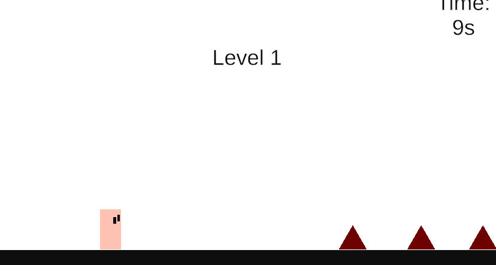

# WEEK 2.1

## Instructions 

Week 2 : Activity 1
Gameplay Mechanics
Subtopics: Handling input (keyboard/gamepad), physics bodies (rigid/kinematic), collision detection. Basics of player controllers (movement, jumping).
Exercises: Build a dodge mechanic or simple platformer character; test with physics tweaks.'

## Work

Movement was achieved using Unity's Input System + a custom PlayerMovement.cs script

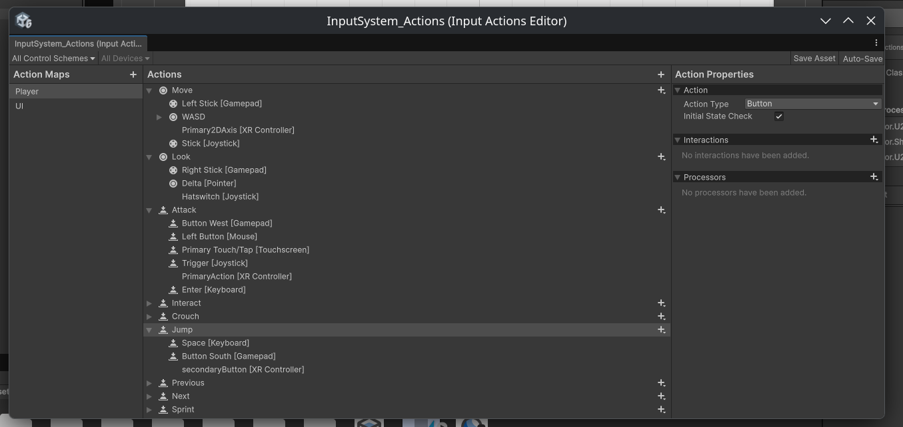
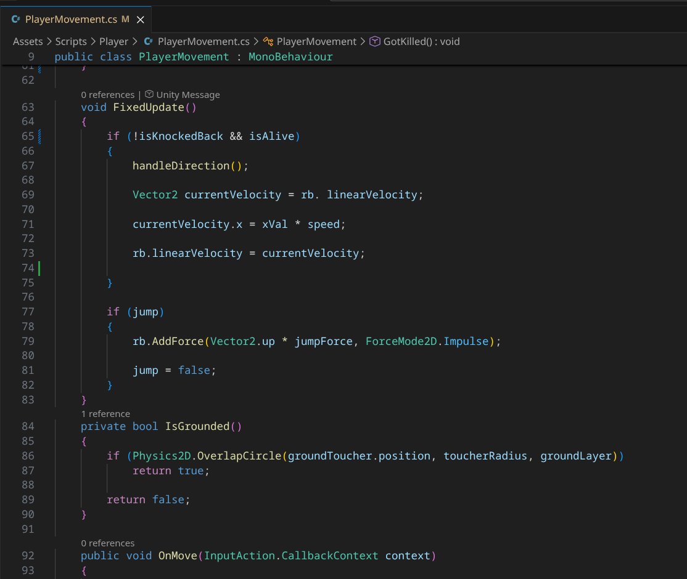

Unity's built in collision system was applied by using the Collision2D & RigidBody2D into the player GameObject. It allows it to give physics to player movement and interaction with the floor (not falling through).

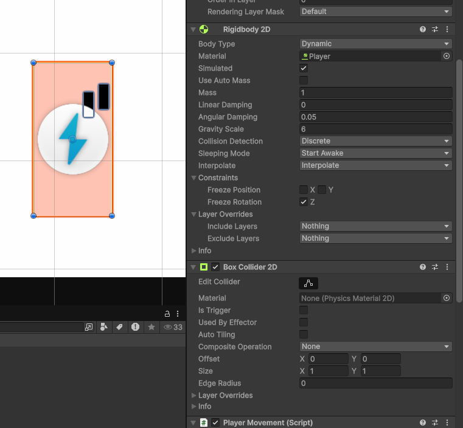

# WEEK 2.2

## Instructions

Week 2 : Activity 2 Level Design (add this in readme.md)
Tilemaps for grid-based levels, adding hazards (spikes/traps), designing flow (pacing, difficulty curves). 
Activity : Design of 2 levels for an endless runner (2D or 3D); Level 1 should be noticeable easier than level 2. Implement traps. No HP, once caught in trap restart from the beginning of the level. There should be a notification when entering level 2.

# Work 

A simple "runner game" with Geometry Dash like gameplay was made. Spikes generate from the right off-screen and come in waves that the player has to avoid by jumping. 

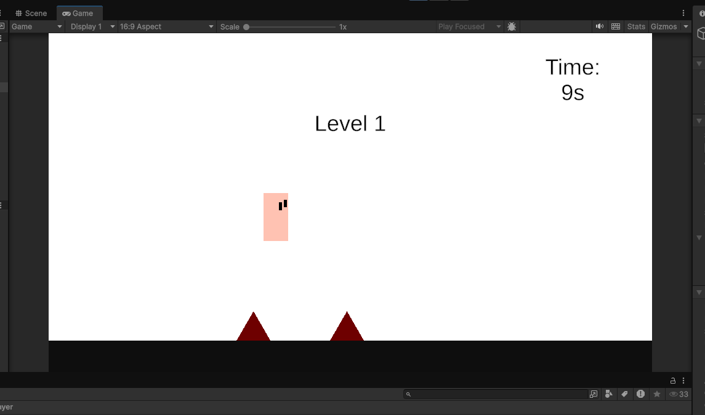

If he gets hit, he dies.

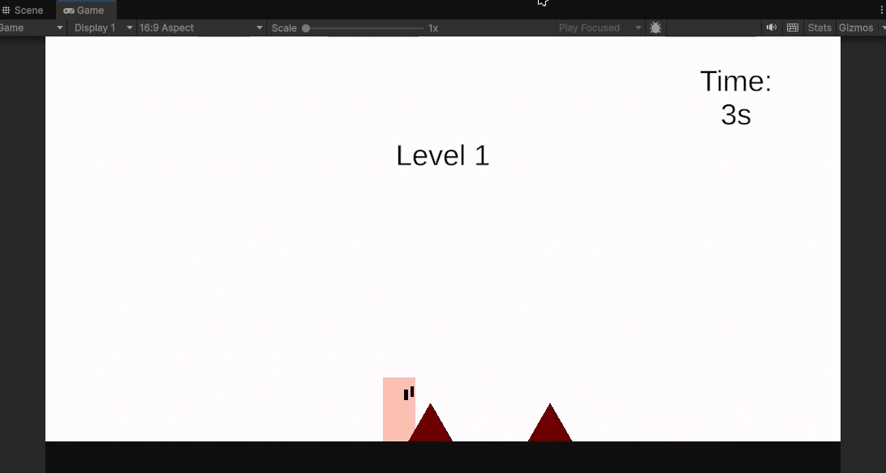
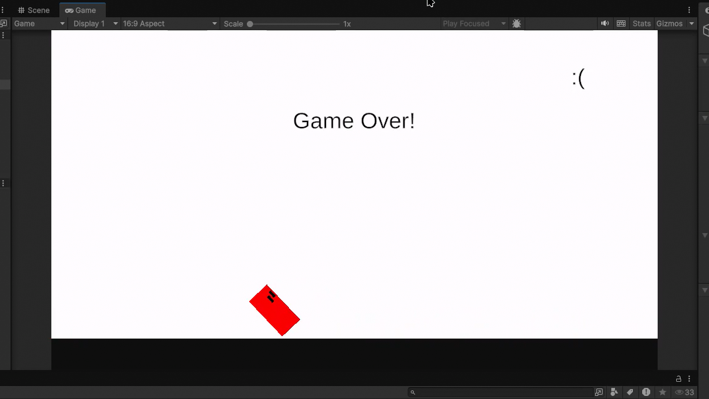

SpikeManager.cs script manages spike spawning rules. "Levels" can be created with some difficulty options, so each level can be harder than the next.

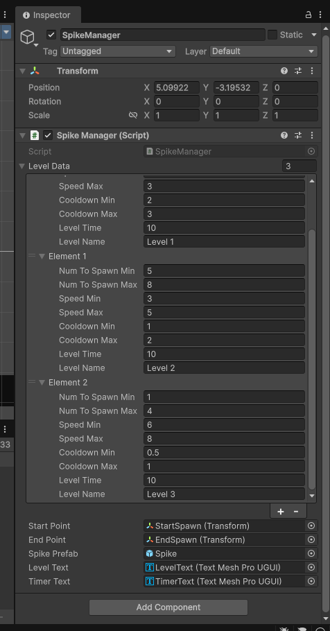

# WEEK 3

## Instructions

Week 3: Activity1 UI/UX & Audio
Subtopics:
      HUD elements (health bars, scores), menu systems (CanvasLayer), audio
      buses for mixing SFX/music.
Exercises:
      Integrate UI into your game proto; add sound effects, walk, run, slash, etc. You may also add game music, introduction, and so on.

Week 3 Activity 2 AI & Enemies
Subtopics:
      Pathfinding navigation, finite state machines for behaviors
      (patrol/attack), enemy AI patterns.
Exercises:
      Add enemies to your game (note enemies, not obstacles)

## Work

For this part, sir allowed me to use "Datu", a previous game I made in a game jam to use as proof of my learning.

Datu features UI in the form of a simple menu, player health and player abilities.

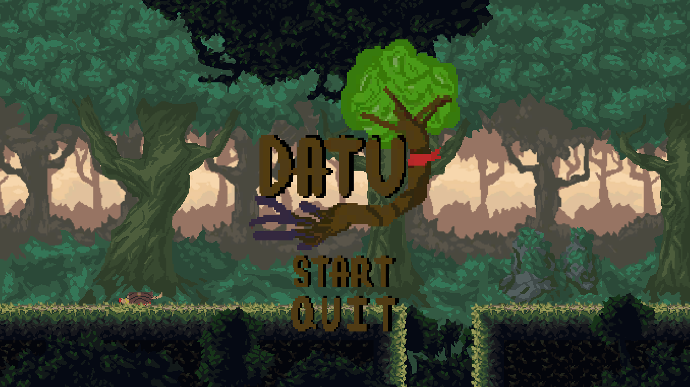
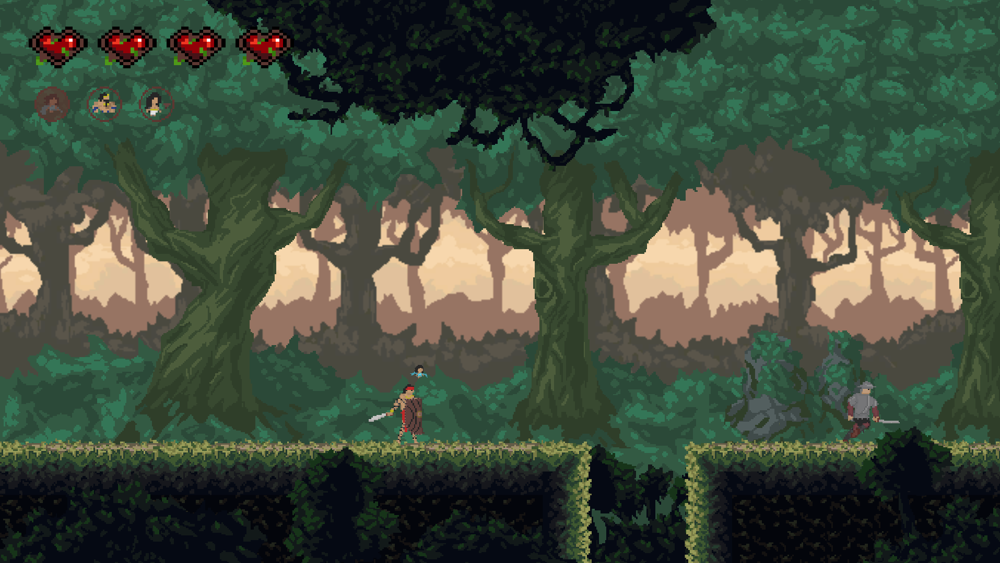

Audio effects are also present, and managed by a dedicated AudioManager.cs

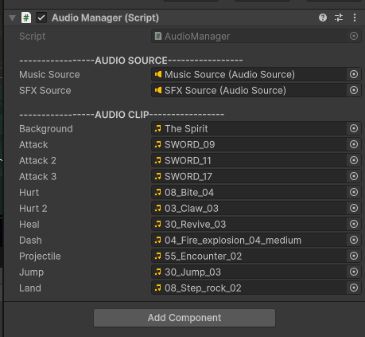

Two basic enemies, "Melee" and "Ranged" are present with simple patrol & attack AI.

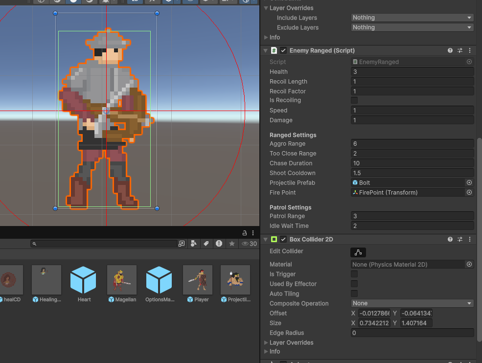
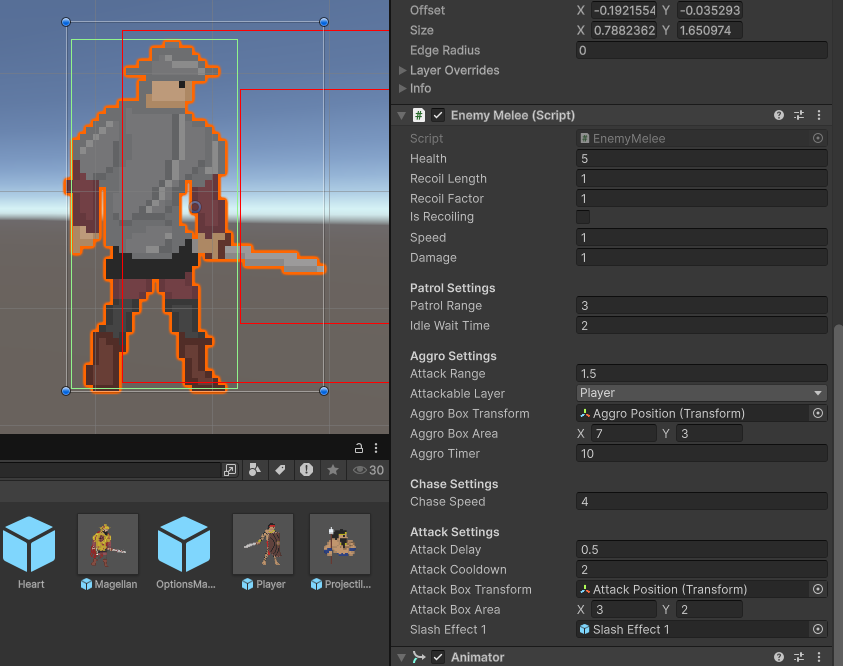

